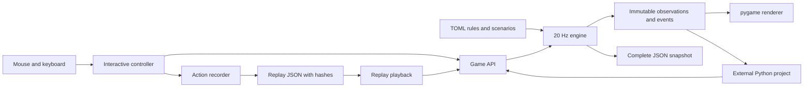
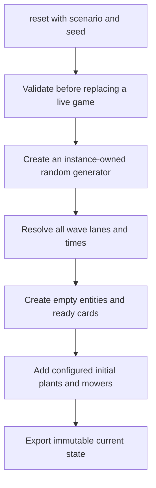
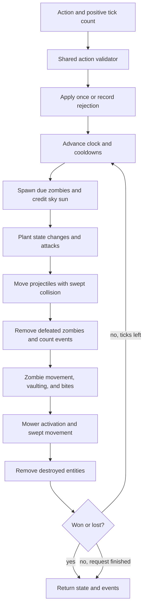
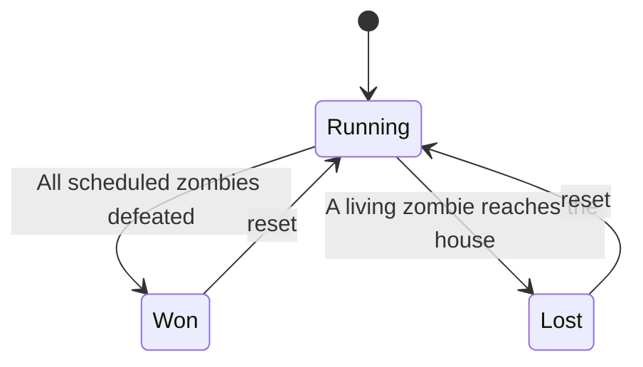
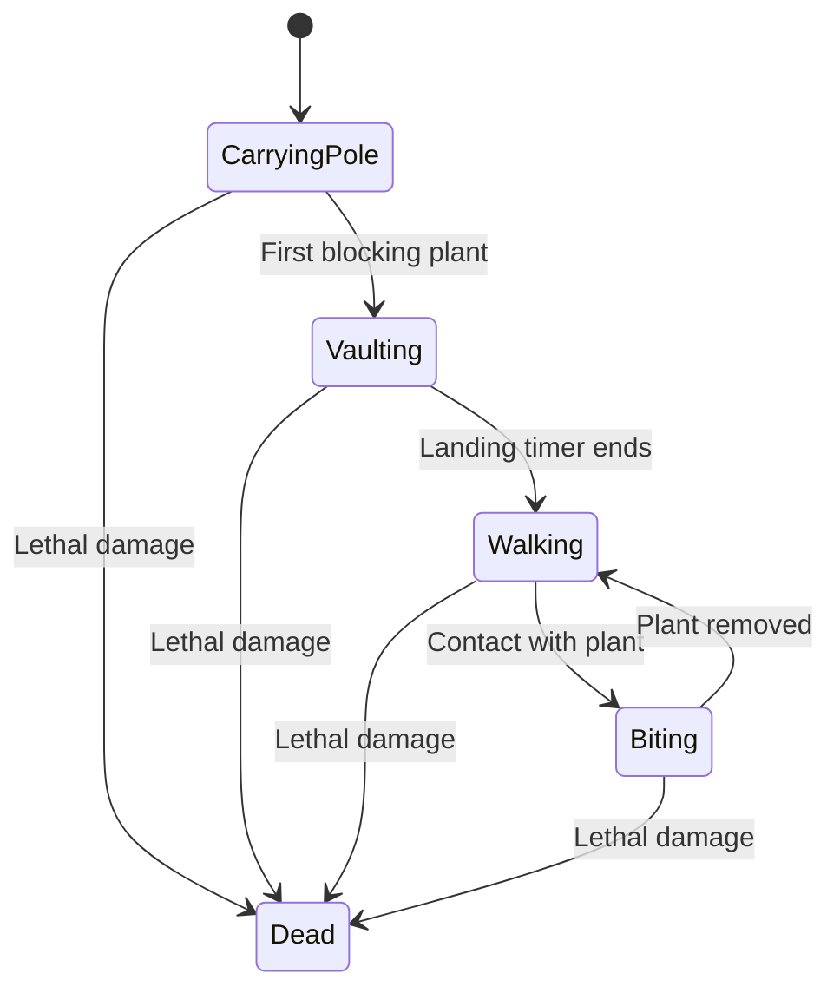

# Current architecture

Lawn Lab has one game engine. Human controls, Python callers, and replay playback all
submit the same actions. The renderer only reads public observations.

## Ownership

| Component | Responsibility |
|---|---|
| `config` | Parse and validate rules, explicit schedules, and generated waves |
| `types` | Frozen actions, events, observations, outcomes, and API versions |
| `engine` | Own all mutable entities, timers, resources, RNG, and game outcomes |
| `replay` | Record actions, restore the initial snapshot, and verify state hashes |
| `ui` | Map input to actions, pace simulation, draw original artwork, and manage screens |
| `cli` | Launch interactive games, replay verification, and headless benchmarks |

The core uses Python's standard library. pygame is imported only by the UI and rendering
tools. The external research project owns observation encoding, rewards, action masks in
framework-specific form, time cutoffs, training, and evaluation protocols.

## Data and reset flow

Generated schedules are fixed at reset. Observations expose only current entities and
aggregate future counts. Complete snapshots also expose the schedule and RNG state.
This difference is deliberate: snapshots are debugging data, not normal agent observations.

Each entity receives a monotonically increasing ID. Dictionary insertion order and
explicit position/ID ordering resolve ties. No shared global RNG or renderer timer affects
the engine. Timers use integer ticks; positions use fixed-point units. Movement retains
fractional remainders when speeds do not divide evenly into ticks.

## One step

Projectile sweeps include zombie movement after projectiles advance. Mower sweeps compare
zombies' old and new positions, so opposite-moving objects cannot pass through one another.
Damage, targeting, removal, resource credit, and legality each have one implementation.
Events count defeats explicitly, including ticks with both new spawns and deaths.

## State transitions

| Entity | Other transitions |
|---|---|
| Ordinary zombie | Walking ↔ Biting → Dead |
| Potato Mine | Arming → Armed → Detonating → Removed |
| Cherry Bomb | Fusing → Exploding → Removed |
| Chomper | Ready → Digesting → Ready |
| Lawn mower | Ready → Moving → Spent |
| Interactive screen | Menu → Playing ↔ Paused → Ended; restart or return to menu |

Detonation and removal can occur in the same tick; events make that transition observable.
Pause belongs to the UI. It stops asking the engine to advance. A frame accumulator keeps
unprocessed time rather than skipping simulation ticks when rendering is slow.

## Reproducibility boundary

Observations are frozen dataclasses containing only frozen values. Snapshots are detached
JSON-safe dictionaries. Restore validates a separate candidate game before replacing the
live instance. A replay embeds its original snapshot, records actions at exact ticks, and
checks hashes at checkpoints and completion. Tick batching does not change final state.

Schema and engine versions are explicit. There is no cross-version snapshot migration.
Platform-independent integer rules are used, but cross-platform determinism has not yet
been experimentally verified; the tested environment is Python 3.12.3 on Windows 11.
