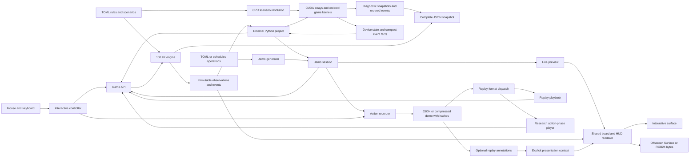
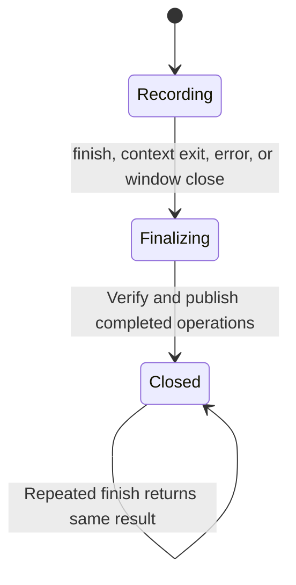
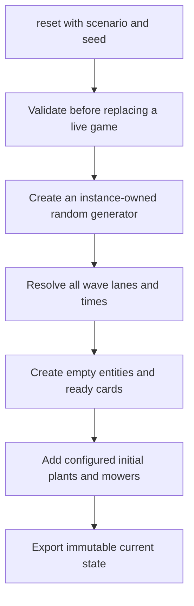
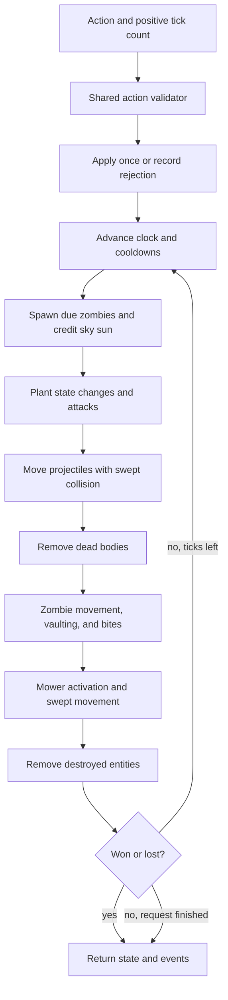
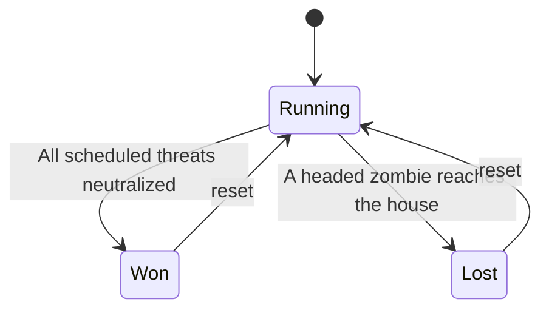
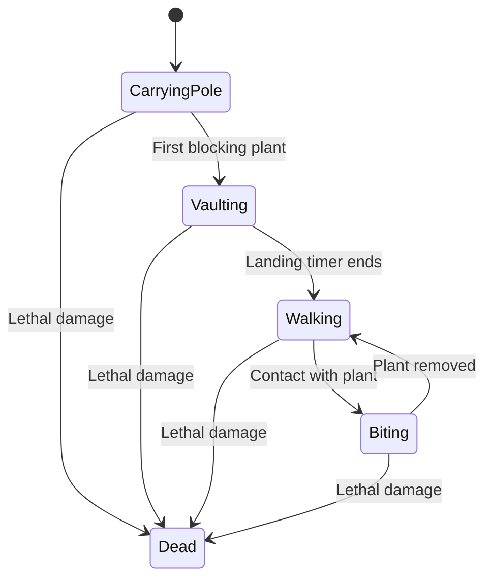
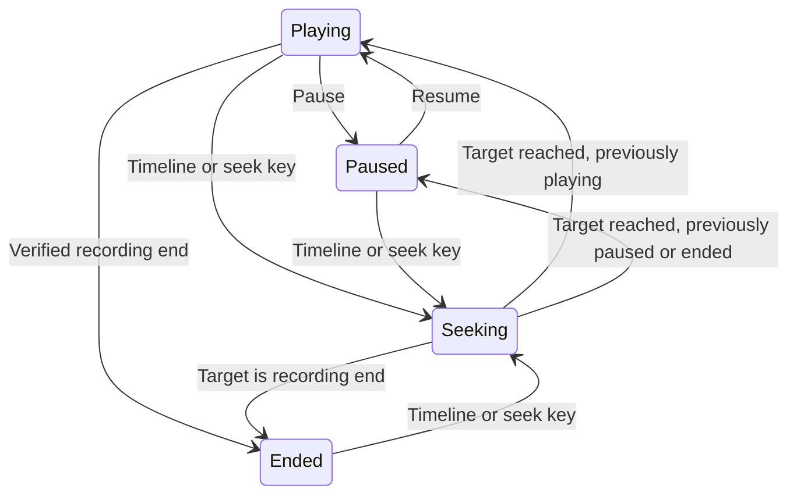
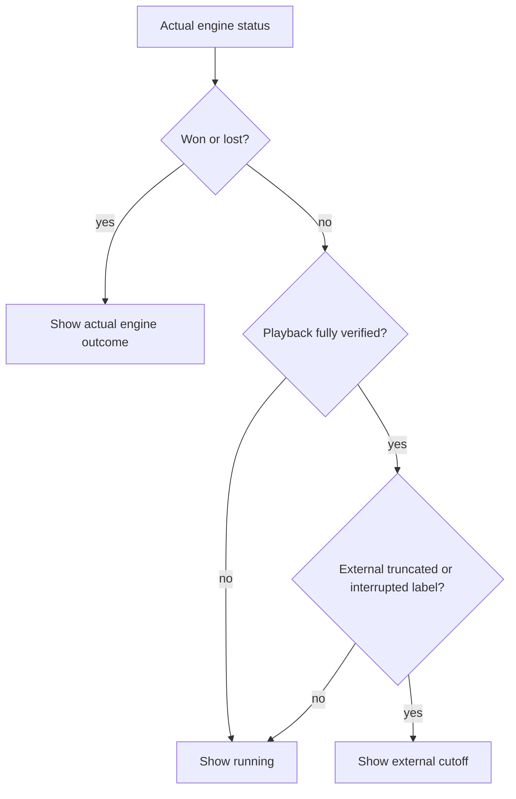
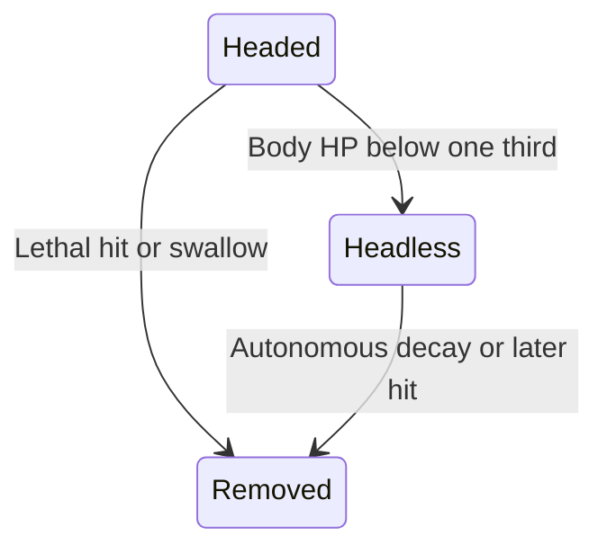

# Current architecture

Lawn Lab has a Python reference simulator and an optional CUDA batch simulator.
Human controls and replay playback use the Python API. CUDA training batches use
the same rules and operation order. The renderer only reads public observations.

## Ownership

| Component | Responsibility |
|---|---|
| `config` | Parse and validate rules, explicit schedules, and generated waves |
| `types` | Frozen actions, events, observations, outcomes, and API versions |
| `engine` | Own all mutable entities, timers, resources, RNG, and game outcomes |
| `cuda` | Optional batched integer simulation, checked reset/step, public numeric state, event facts, diagnostic snapshots and hashes |
| `replay` | Record actions, verify state hashes, and carry detached external annotations |
| `demo` | Validate scheduled actions, record submitted calls, finalize external outcomes and atomic files |
| `demo_ui` | Pace live session ticks, process preview input, and render public observations |
| `art` | Original plant/zombie primitives and shared drawing helpers; palette/labels in `theme.toml` |
| `rendering` | Draw a public observation and explicit presentation options into a Surface or RGB bytes |
| `ui` | Map input to actions, pace simulation, call the shared renderer, and manage screens |
| `cli` | Launch games, verify/watch replays, export final frames, and measure headless execution |

`DemoSession` wraps a reset Game and one Recorder. Recorder's internal presentation hooks
allow the live preview to run between fixed ticks while retaining one entry per submitted
call. Headless calls retain the fast batched engine path. Both paths return equivalent events,
action results, observations, and hashes. The session verifies its complete recording before
publishing it atomically. A cancelled call records only its completed ticks.

The generator fills gaps between scheduled operations with waits. It stops on a natural
outcome or an explicit cutoff; it uses the same session for recording and optional live
preview. Live pause stops requested ticks without changing the Game status. The caller owns
execution between streaming calls; live preview does not start a worker thread.

The core uses Python's standard library. pygame is imported only by the UI and rendering
tools. The external research project owns observation encoding, rewards, action masks in
framework-specific form, time cutoffs, training, and evaluation protocols.

The shared HUD displays `counts.defeated/counts.initial_total`, such as `2/15`. All views use
this one formatter; integer observation counts and game outcomes count neutralized threats; headless bodies remain in the entity list until removal.

`BoardRenderer` accepts an observation, optional `RenderContext`, and optional `RenderOptions`.
It never takes a Game, seed, snapshot, or future schedule. Selection, hover coordinates, legal
actions, and inspection/effects come from explicit options. The interactive controller gets
legal actions from the engine's shared validator; drawing never reads input devices.

The renderer initializes fonts only. `render` owns a fresh output surface; `draw` uses a
caller-owned native-size surface and restores its clip. RGB24 bytes are immutable, row-major,
top row first, with no padding. Optional scaling preserves aspect ratio with letterboxing.
The UI owns its display and event loop; offscreen consumers need neither.

## Data and reset flow

Generated schedules are fixed at reset. Observations expose only current entities and
aggregate future counts. Complete snapshots also expose the schedule and RNG state.
This difference is deliberate: snapshots are debugging data, not normal agent observations.

Each entity receives a monotonically increasing ID. Dictionary insertion order and
explicit position/ID ordering resolve ties. No shared global RNG or renderer timer affects
the engine. Timers use integer ticks; positions use fixed-point units. Movement retains
fractional remainders when speeds do not divide evenly into ticks.

## One step

Projectile sweeps include zombie movement after projectiles advance. Mower sweeps compare
zombies' old and new positions, so opposite-moving objects cannot pass through one another.
Damage, targeting, removal, resource credit, and legality each have one implementation.
Events count defeats explicitly, including ticks with both new spawns and deaths.

## State transitions

| Entity | Other transitions |
|---|---|
| Ordinary zombie | Walking ↔ Biting → Dead |
| Potato Mine | Arming → Rising → Armed → Detonating → Removed |
| Cherry Bomb | Fusing → Exploding → Removed |
| Chomper | Ready → Biting → Digesting → Recovering → Ready |
| Lawn mower | Ready → Moving → Spent |
| Interactive screen | Menu → Playing ↔ Paused → Ended; restart or return to menu |

Seeking restores the nearest usable in-memory snapshot and replay cursor, then advances
through the same Playback step implementation. The UI consumes bounded chunks between input
frames. The initial snapshot plus at most 64 recent snapshots are retained, spaced every 200
ticks. Cache entries include the latest operation for correct feedback after rewinding.
Snapshots restore the existing Game instance; references held by a controller remain valid.
Seek caches and transient rendering effects are never serialized into demo files.

Detonation and removal can occur in the same tick; events make that transition observable.
Pause belongs to the UI. It stops asking the engine to advance. A frame accumulator keeps
unprocessed time rather than skipping simulation ticks when rendering is slow.

## Reproducibility boundary

Observations are frozen dataclasses containing only frozen values. Snapshots are detached
JSON-safe dictionaries. Restore validates a separate candidate game before replacing the
live instance. A replay embeds its original snapshot, records actions at exact ticks, and
checks hashes at checkpoints and completion. Tick batching does not change final state.

Replay metadata contains finite JSON annotations, copied on input and export. It never
enters snapshots, observations, actions, or state hashes. State verification checks simulation
consistency, not the authenticity of a caller-supplied policy name or checkpoint checksum.

`Playback.display_outcome` implements this resolution. Direct renderer users supply their
presentation context explicitly and decide when an external cutoff applies. Neither path
changes the engine's Running/Won/Lost state machine.

Schema and engine versions are explicit. Package releases can share a simulation compatibility
identifier when rules and state semantics are unchanged: package 1.5.0 uses engine 1.2.0 and
snapshot/CUDA schema version 2. There is no migration across incompatible snapshot versions.
Platform-independent integer rules are used, but cross-platform determinism has not yet
been experimentally verified; the tested environment is Python 3.12.3 on Windows 11.

## Research recording playback

`Playback` accepts ordinary version 1 and `pvz-rl/actions-v1`. The latter dispatches
into `action_replay`, which applies zero-time plant/dig operations between normal
combat ticks. It has no learning-library dependency. Seeking includes all instant
operations at the requested tick, verifies hashes, and preserves game identity.
The normal Game API continues requiring positive ticks. Unknown formats fail.

## Production and combat phases

The [mechanics contract](math/pc-mechanics.md) defines timing, ranges and
reconstruction limits. Every game owns a portable gameplay RNG separate from
scenario generation. Its state and sky production counters are checkpointed;
CUDA headers carry them alongside entity phases. Public views expose headless
state and current health, but never the RNG or future schedule.

Only the first transition out of Headed increments the neutralized count.
Autonomous decay emits its own event and cannot masquerade as plant damage.
Headless bodies cannot bite, vault, activate an idle mower or breach the house.
Victory counts neutralized threats, including those with a body still visible.

Mine phases are underground, rising, armed, detonated. Chomper phases are ready,
biting, caught/missed, digesting, recovering, ready. Shooter cycle deadlines run
even without targets; target acquisition schedules a separate shot windup.
